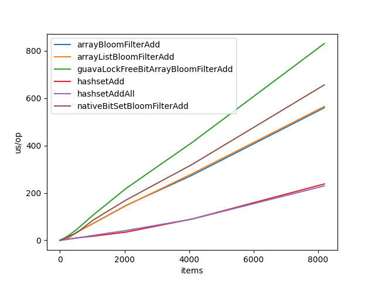
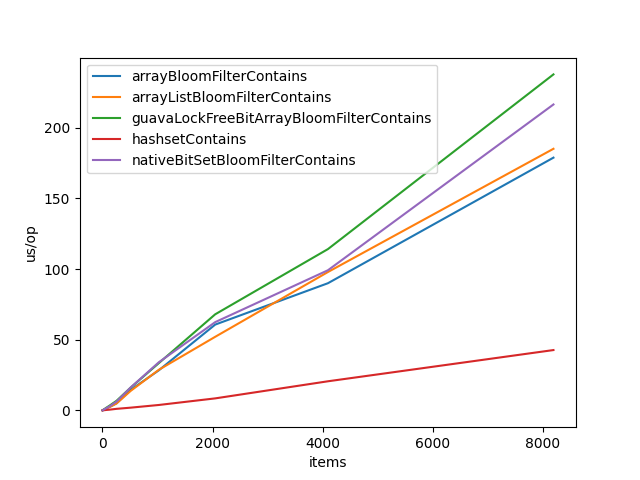

# Simple Bloom Filter implementation in java
## References:
- https://fr.wikipedia.org/wiki/Filtre_de_Bloom
- https://llimllib.github.io/bloomfilter-tutorial/
- https://fr.wikipedia.org/wiki/Fonction_de_hachage
- https://www.geeksforgeeks.org/bloom-filters-introduction-and-python-implementation/
- https://andybui01.github.io/bloom-filter/#implementation-and-benchmarks // for formulas
- https://github.com/andybui01/Bloom/blob/main/include/bloom/bloom.h
- https://github.com/eugenp/tutorials/blob/master/guava-modules/guava-utilities/src/test/java/com/baeldung/guava/bloomfilter/BloomFilterUnitTest.java # usage of guava's bloom filter
- https://github.com/google/guava/blob/master/guava/src/com/google/common/hash/BloomFilterStrategies.java # guava's bloom filter's strategies

### hash functions
- https://sites.google.com/site/murmurhash/
- https://gist.github.com/sgsfak/9ba382a0049f6ee885f68621ae86079b

### micro benchmarking
- https://stackoverflow.com/questions/51232809/performance-comparison-of-modulo-operator-and-bitwise-and
- https://stackoverflow.com/questions/504103/how-do-i-write-a-correct-micro-benchmark-in-java
- https://www.baeldung.com/java-microbenchmark-harness
- https://www.loicmathieu.fr/wordpress/informatique/introduction-a-jmh-java-microbenchmark-harness/
- http://leogomes.github.io/assets/JMH_cheatsheet.pdf
- https://github.com/guozheng/jmh-tutorial // for the jar build

## how to run

run benchmarks
```bash
mvn clean install

java -jar target/benchmarks.jar # for all benchmarks
# or
java -jar target/benchmarks.jar com.leikoe.Bencher # for only bloom filter benchmarks
java -jar target/benchmarks.jar com.leikoe.ObjectToByte # for only ObjectToBytes benchmarks
```

Unit tests
```bash
mvn test 
```

## Optimisations
> Benchmarks are all done with the same haashFunctions arrayList, but it might not be 
> the same as the one currently pushed on the repo. 

### From Object to byte[]
At first, I used a stack overflow answer to go from an Object to byte[], this is the code in Utils.objectToBytes().
```java
public static byte[] objectToBytes(Object object) {
    try (ByteArrayOutputStream bos = new ByteArrayOutputStream(); ObjectOutputStream oos = new ObjectOutputStream(bos)) {
        oos.writeObject(object);
        return bos.toByteArray();
    } catch (IOException e) {
        throw new RuntimeException(e);
    }
}
```
but, after doing the BloomFilter benchmarks, I found that I was much slower than java's HashSet, even when only using one hash function, 
the same one used in the HashSet, so it couldn't be my hash functions fault. After some more digging, this is the implementation most java BloomFilters use.
```java
public static byte[] objectToStringToBytes(Object object) {
    if(object == null) {
        return new byte[]{}; // null is represented by an empty byte array
    }

    // no need for .toString() when object is already a String
    if(object instanceof String) {
        return ((String) object).getBytes(StandardCharsets.UTF_8);
    }

    return object.toString().getBytes(StandardCharsets.UTF_8);
}
```
This proved to be much faster, about a 10x speedup.

```text
Benchmark                                         Mode  Cnt  Score   Error  Units
ObjectToByteArrayBenchmark.serilizationDouble     avgt    5  0.647 ± 0.019  us/op
ObjectToByteArrayBenchmark.serilizationInteger    avgt    5  0.640 ± 0.020  us/op
ObjectToByteArrayBenchmark.serilizationString     avgt    5  0.452 ± 0.015  us/op
ObjectToByteArrayBenchmark.stringGetBytesDouble   avgt    5  0.098 ± 0.005  us/op
ObjectToByteArrayBenchmark.stringGetBytesInteger  avgt    5  0.055 ± 0.005  us/op
ObjectToByteArrayBenchmark.stringGetBytesString   avgt    5  0.072 ± 0.006  us/op
```

### murmurHash2 Optimizations

Loading **4 bytes** into **int** optimisation
```java
// going from 
int k = ByteBuffer.wrap(Arrays.copyOfRange(data, i, i+4)).getInt();
// to
int k = ByteBuffer.wrap(data, i, 4);
```
```text
Benchmark                              (size)  Mode  Cnt     Score    Error  Units
Bencher.arrayBloomFilterAdd                10  avgt    5    13.307 ±  0.639  us/op
Bencher.arrayBloomFilterAdd              1000  avgt    5    13.473 ±  1.042  us/op
Bencher.arrayBloomFilterAdd            100000  avgt    5    14.225 ±  0.227  us/op
Bencher.arrayBloomFilterContains           10  avgt    5    13.281 ±  0.356  us/op
Bencher.arrayBloomFilterContains         1000  avgt    5    12.992 ±  3.369  us/op
Bencher.arrayBloomFilterContains       100000  avgt    5    14.173 ±  0.418  us/op
Bencher.arrayListBloomFilterAdd            10  avgt    5    12.764 ±  3.911  us/op
Bencher.arrayListBloomFilterAdd          1000  avgt    5    12.061 ±  4.064  us/op
Bencher.arrayListBloomFilterAdd        100000  avgt    5    14.098 ±  0.139  us/op
Bencher.arrayListBloomFilterContains       10  avgt    5    12.617 ±  3.500  us/op
Bencher.arrayListBloomFilterContains     1000  avgt    5    13.379 ±  0.234  us/op
Bencher.arrayListBloomFilterContains   100000  avgt    5    14.264 ±  0.260  us/op
Bencher.linkedListBloomFilterAdd           10  avgt    5    13.033 ±  2.599  us/op
Bencher.linkedListBloomFilterAdd         1000  avgt    5    24.772 ±  0.117  us/op
Bencher.linkedListBloomFilterAdd       100000  avgt    5  1275.189 ± 35.425  us/op
Bencher.linkedListBloomFilterContains      10  avgt    5    12.811 ±  5.370  us/op
Bencher.linkedListBloomFilterContains    1000  avgt    5    22.341 ±  1.643  us/op
Bencher.linkedListBloomFilterContains  100000  avgt    5  1288.736 ± 64.979  us/op
```
to
```text
Benchmark                              (size)  Mode  Cnt     Score    Error  Units
Bencher.arrayBloomFilterAdd                10  avgt    5    11.430 ±  5.403  us/op
Bencher.arrayBloomFilterAdd              1000  avgt    5    11.303 ±  4.107  us/op
Bencher.arrayBloomFilterAdd            100000  avgt    5    12.632 ±  1.905  us/op
Bencher.arrayBloomFilterContains           10  avgt    5    11.860 ±  0.813  us/op
Bencher.arrayBloomFilterContains         1000  avgt    5    11.161 ±  6.221  us/op
Bencher.arrayBloomFilterContains       100000  avgt    5    12.710 ±  0.513  us/op
Bencher.arrayListBloomFilterAdd            10  avgt    5    10.126 ±  4.166  us/op
Bencher.arrayListBloomFilterAdd          1000  avgt    5    11.106 ±  3.977  us/op
Bencher.arrayListBloomFilterAdd        100000  avgt    5    12.666 ±  1.566  us/op
Bencher.arrayListBloomFilterContains       10  avgt    5    10.920 ±  5.341  us/op
Bencher.arrayListBloomFilterContains     1000  avgt    5    10.982 ±  5.409  us/op
Bencher.arrayListBloomFilterContains   100000  avgt    5    12.501 ±  1.873  us/op
Bencher.linkedListBloomFilterAdd           10  avgt    5    10.365 ±  4.681  us/op
Bencher.linkedListBloomFilterAdd         1000  avgt    5    23.979 ±  0.258  us/op
Bencher.linkedListBloomFilterAdd       100000  avgt    5  1273.741 ± 29.381  us/op
Bencher.linkedListBloomFilterContains      10  avgt    5    10.893 ±  5.591  us/op
Bencher.linkedListBloomFilterContains    1000  avgt    5    24.021 ±  0.493  us/op
Bencher.linkedListBloomFilterContains  100000  avgt    5  1275.462 ± 59.471  us/op
```

Then, tried to improve further by removing the allocation of a new ByteBuffer
```java
// going from 
int k = ByteBuffer.wrap(data, i, 4);
// to
int k = data[i]
        + data[i+1] << 8
        + data[i+2] << 16
        + data[i+3] << 24;
```
```text
Benchmark                              (size)  Mode  Cnt    Score    Error  Units
Bencher.arrayBloomFilterAdd                10  avgt    5    9.258 ±  0.491  us/op
Bencher.arrayBloomFilterAdd              1000  avgt    5    9.137 ±  0.704  us/op
Bencher.arrayBloomFilterAdd            100000  avgt    5    9.272 ±  0.160  us/op
Bencher.arrayBloomFilterContains           10  avgt    5    9.222 ±  0.485  us/op
Bencher.arrayBloomFilterContains         1000  avgt    5    9.229 ±  0.324  us/op
Bencher.arrayBloomFilterContains       100000  avgt    5    9.275 ±  0.332  us/op
Bencher.arrayListBloomFilterAdd            10  avgt    5    9.105 ±  0.525  us/op
Bencher.arrayListBloomFilterAdd          1000  avgt    5    9.167 ±  0.350  us/op
Bencher.arrayListBloomFilterAdd        100000  avgt    5    9.297 ±  0.442  us/op
Bencher.arrayListBloomFilterContains       10  avgt    5    9.198 ±  0.311  us/op
Bencher.arrayListBloomFilterContains     1000  avgt    5    9.224 ±  0.532  us/op
Bencher.arrayListBloomFilterContains   100000  avgt    5    9.256 ±  0.107  us/op
Bencher.linkedListBloomFilterAdd           10  avgt    5    9.286 ±  0.425  us/op
Bencher.linkedListBloomFilterAdd         1000  avgt    5   17.757 ±  0.438  us/op
Bencher.linkedListBloomFilterAdd       100000  avgt    5  618.787 ± 39.022  us/op
Bencher.linkedListBloomFilterContains      10  avgt    5    9.566 ±  0.896  us/op
Bencher.linkedListBloomFilterContains    1000  avgt    5   18.062 ±  0.483  us/op
Bencher.linkedListBloomFilterContains  100000  avgt    5  623.874 ± 30.746  us/op
```
we got a lot faster.

### BloomFilter optimizations
The mightContain() method's code was
```java
public boolean mightContain(T value) {
    boolean all_true = true;
    for (ToIntFunction<T> hashFunction: this.hashFunctions) {
        int pos = hashFunction.applyAsInt(value);
        boolean v = bits.get(positiveMod(pos, bits.size()));
        all_true = all_true && v;
    }

    return all_true;
}
```
changed to
```java
public boolean mightContain(T value) {
    boolean all_true = true;
    for (int i=0; all_true && i<this.hashFunctions.size(); i++) {
        ToIntFunction<T> hashFunction = this.hashFunctions.get(i);
        int pos = hashFunction.applyAsInt(value);
        all_true = bits.get(positiveMod(pos, bits.size()));
    }

    return all_true;
}
```
This provided a 20% performance boost across the board. (baseline is hashset contains from java's collections)


C style for loops tend to be faster than iterator based ones, 
this could explain the performance gain but i don't think it's the only factor here.

Then looking at some other implementations and reading papers (such as "Vectorized Bloom Filters for Advanced SIMD Processors"), I understood that we didn't need K hash functions, we just needed two base ones and then bishift + multiply would work for the next k-2 functions.
With this knowlegde, I produced the following code:
```java
public boolean mightContain(T value) {
        long[] hashes = new long[]{0, 0};

        boolean all_true = true;
        for (int i=0; all_true && i<this.k; i++) {
            long pos = hash(hashes, value, i);
            all_true = bits.get(positiveMod(pos, bits.size()));
        }

        return all_true;
}
```

Which i then optimized by removing the allocation:
```java
public boolean mightContain(T value) {
        hashes[0] = 0;
        hashes[1] = 0;

        boolean all_true = true;
        for (int i=0; all_true && i<this.k; i++) {
            long pos = hash(hashes, value, i);
            all_true = bits.get(positiveMod(pos, bits.size()));
        }

        return all_true;
}
```
and adding a long[] hashes in the class attributes, which gets allocated and initialized in the constructor.

Removing the allocation provided the following speedup:
```text
Bencher.arrayBloomFilterAdd                          8192  avgt    5       559.725 ±     21.785  us/op
Bencher.arrayBloomFilterContains                     8192  avgt    5       178.845 ±     27.856  us/op
```
to 
```text
Bencher.arrayBloomFilterAdd                          8192  avgt    5       308.701 ±     35.437  us/op
Bencher.arrayBloomFilterContains                     8192  avgt    5        93.384 ±     60.560  us/op
```
about a 2x speedup.

## BitsContainer optimizations

according to https://stackoverflow.com/questions/605226/boolean-vs-bitset-which-is-more-efficient
> After some research, it appears that java's boolean type is more than a bit wide, java's solution is poviding us with a BitSet, which internally uses longs to store bits without wasting space.
> Taking advantage of this, I implemented NativeBitSet which implements IBitsContainer

## Tests optimizations

When using getObservedFalsePositives() in my tests, i noticed it was way slower than expected,
I initially thought it was my bloom filter being slow when checking if a given items belongs in it, but no.
It was the array list used to accumulate added values, found that out using the profiler, cpu was using 90% of it's time traversing the array list for the .contains calls.
Replaced it by an hashset and now its blazingly fast :speed: .

## Full Benchmarks


**and without linked list**




When we look at the charts without the linked list, we can clearly see lines, which indicate a complexity of O(n), but when we add the linked list to the chart, it's a curve ! This indicates O(n^2), and the other lines look flat compared to it, even tho they are O(n).
What's weird is, we know from textbooks that linked list random access is O(n), and array/array list random access is O(1), why are we getting O(n^2) and O(n) ?
The answer is simple, since for each benchmark, we insert n elements, the compexity is multiplied by n. This gives results which explain perfectly the curves we are seeing on the charts.

```text
Benchmark                                         (items)  Mode  Cnt         Score        Error  Units
Bencher.arrayBloomFilterAdd                             2  avgt    5         0.076 ±      0.043  us/op
Bencher.arrayBloomFilterAdd                             4  avgt    5         0.124 ±      0.009  us/op
Bencher.arrayBloomFilterAdd                             8  avgt    5         0.251 ±      0.107  us/op
Bencher.arrayBloomFilterAdd                            16  avgt    5         0.455 ±      0.016  us/op
Bencher.arrayBloomFilterAdd                            32  avgt    5         0.869 ±      0.032  us/op
Bencher.arrayBloomFilterAdd                            64  avgt    5         1.696 ±      0.080  us/op
Bencher.arrayBloomFilterAdd                           128  avgt    5         4.452 ±      0.438  us/op
Bencher.arrayBloomFilterAdd                           256  avgt    5         9.350 ±      0.792  us/op
Bencher.arrayBloomFilterAdd                           512  avgt    5        33.236 ±      0.203  us/op
Bencher.arrayBloomFilterAdd                          1024  avgt    5        70.687 ±     12.394  us/op
Bencher.arrayBloomFilterAdd                          2048  avgt    5       147.321 ±     17.079  us/op
Bencher.arrayBloomFilterAdd                          4096  avgt    5       275.007 ±     36.451  us/op
Bencher.arrayBloomFilterAdd                          8192  avgt    5       559.725 ±     21.785  us/op
Bencher.arrayBloomFilterContains                        2  avgt    5         0.070 ±      0.030  us/op
Bencher.arrayBloomFilterContains                        4  avgt    5         0.115 ±      0.012  us/op
Bencher.arrayBloomFilterContains                        8  avgt    5         0.186 ±      0.072  us/op
Bencher.arrayBloomFilterContains                       16  avgt    5         0.343 ±      0.046  us/op
Bencher.arrayBloomFilterContains                       32  avgt    5         0.651 ±      0.114  us/op
Bencher.arrayBloomFilterContains                       64  avgt    5         1.324 ±      0.288  us/op
Bencher.arrayBloomFilterContains                      128  avgt    5         2.425 ±      0.451  us/op
Bencher.arrayBloomFilterContains                      256  avgt    5         5.101 ±      1.117  us/op
Bencher.arrayBloomFilterContains                      512  avgt    5        14.572 ±      2.581  us/op
Bencher.arrayBloomFilterContains                     1024  avgt    5        28.394 ±      2.314  us/op
Bencher.arrayBloomFilterContains                     2048  avgt    5        60.743 ±     13.630  us/op
Bencher.arrayBloomFilterContains                     4096  avgt    5        90.017 ±     23.582  us/op
Bencher.arrayBloomFilterContains                     8192  avgt    5       178.845 ±     27.856  us/op
Bencher.arrayListBloomFilterAdd                         2  avgt    5         0.080 ±      0.043  us/op
Bencher.arrayListBloomFilterAdd                         4  avgt    5         0.137 ±      0.058  us/op
Bencher.arrayListBloomFilterAdd                         8  avgt    5         0.256 ±      0.114  us/op
Bencher.arrayListBloomFilterAdd                        16  avgt    5         0.476 ±      0.170  us/op
Bencher.arrayListBloomFilterAdd                        32  avgt    5         0.893 ±      0.030  us/op
Bencher.arrayListBloomFilterAdd                        64  avgt    5         1.747 ±      0.115  us/op
Bencher.arrayListBloomFilterAdd                       128  avgt    5         4.443 ±      0.160  us/op
Bencher.arrayListBloomFilterAdd                       256  avgt    5         9.462 ±      1.805  us/op
Bencher.arrayListBloomFilterAdd                       512  avgt    5        33.580 ±      1.070  us/op
Bencher.arrayListBloomFilterAdd                      1024  avgt    5        71.131 ±      3.120  us/op
Bencher.arrayListBloomFilterAdd                      2048  avgt    5       146.321 ±     22.263  us/op
Bencher.arrayListBloomFilterAdd                      4096  avgt    5       281.415 ±     40.842  us/op
Bencher.arrayListBloomFilterAdd                      8192  avgt    5       565.145 ±     13.229  us/op
Bencher.arrayListBloomFilterContains                    2  avgt    5         0.072 ±      0.033  us/op
Bencher.arrayListBloomFilterContains                    4  avgt    5         0.114 ±      0.032  us/op
Bencher.arrayListBloomFilterContains                    8  avgt    5         0.196 ±      0.065  us/op
Bencher.arrayListBloomFilterContains                   16  avgt    5         0.359 ±      0.071  us/op
Bencher.arrayListBloomFilterContains                   32  avgt    5         0.656 ±      0.058  us/op
Bencher.arrayListBloomFilterContains                   64  avgt    5         1.267 ±      0.158  us/op
Bencher.arrayListBloomFilterContains                  128  avgt    5         2.411 ±      0.163  us/op
Bencher.arrayListBloomFilterContains                  256  avgt    5         4.922 ±      1.084  us/op
Bencher.arrayListBloomFilterContains                  512  avgt    5        13.816 ±      0.423  us/op
Bencher.arrayListBloomFilterContains                 1024  avgt    5        28.762 ±      3.989  us/op
Bencher.arrayListBloomFilterContains                 2048  avgt    5        52.100 ±     34.029  us/op
Bencher.arrayListBloomFilterContains                 4096  avgt    5        97.943 ±     61.743  us/op
Bencher.arrayListBloomFilterContains                 8192  avgt    5       185.108 ±     45.971  us/op
Bencher.guavaLockFreeBitArrayBloomFilterAdd             2  avgt    5         0.175 ±      0.019  us/op
Bencher.guavaLockFreeBitArrayBloomFilterAdd             4  avgt    5         0.358 ±      0.057  us/op
Bencher.guavaLockFreeBitArrayBloomFilterAdd             8  avgt    5         0.702 ±      0.126  us/op
Bencher.guavaLockFreeBitArrayBloomFilterAdd            16  avgt    5         1.278 ±      0.181  us/op
Bencher.guavaLockFreeBitArrayBloomFilterAdd            32  avgt    5         2.244 ±      0.431  us/op
Bencher.guavaLockFreeBitArrayBloomFilterAdd            64  avgt    5         4.712 ±      0.413  us/op
Bencher.guavaLockFreeBitArrayBloomFilterAdd           128  avgt    5         9.155 ±      3.076  us/op
Bencher.guavaLockFreeBitArrayBloomFilterAdd           256  avgt    5        19.359 ±      2.842  us/op
Bencher.guavaLockFreeBitArrayBloomFilterAdd           512  avgt    5        45.275 ±      3.707  us/op
Bencher.guavaLockFreeBitArrayBloomFilterAdd          1024  avgt    5       106.352 ±      2.193  us/op
Bencher.guavaLockFreeBitArrayBloomFilterAdd          2048  avgt    5       219.092 ±     16.184  us/op
Bencher.guavaLockFreeBitArrayBloomFilterAdd          4096  avgt    5       413.210 ±     19.336  us/op
Bencher.guavaLockFreeBitArrayBloomFilterAdd          8192  avgt    5       830.881 ±     45.375  us/op
Bencher.guavaLockFreeBitArrayBloomFilterContains        2  avgt    5         0.094 ±      0.008  us/op
Bencher.guavaLockFreeBitArrayBloomFilterContains        4  avgt    5         0.146 ±      0.020  us/op
Bencher.guavaLockFreeBitArrayBloomFilterContains        8  avgt    5         0.273 ±      0.108  us/op
Bencher.guavaLockFreeBitArrayBloomFilterContains       16  avgt    5         0.508 ±      0.163  us/op
Bencher.guavaLockFreeBitArrayBloomFilterContains       32  avgt    5         0.861 ±      0.056  us/op
Bencher.guavaLockFreeBitArrayBloomFilterContains       64  avgt    5         1.784 ±      0.378  us/op
Bencher.guavaLockFreeBitArrayBloomFilterContains      128  avgt    5         3.394 ±      1.157  us/op
Bencher.guavaLockFreeBitArrayBloomFilterContains      256  avgt    5         6.828 ±      1.825  us/op
Bencher.guavaLockFreeBitArrayBloomFilterContains      512  avgt    5        16.136 ±      3.742  us/op
Bencher.guavaLockFreeBitArrayBloomFilterContains     1024  avgt    5        33.489 ±      9.377  us/op
Bencher.guavaLockFreeBitArrayBloomFilterContains     2048  avgt    5        68.015 ±     42.307  us/op
Bencher.guavaLockFreeBitArrayBloomFilterContains     4096  avgt    5       114.159 ±     53.370  us/op
Bencher.guavaLockFreeBitArrayBloomFilterContains     8192  avgt    5       237.739 ±     20.018  us/op
Bencher.hashsetAdd                                      2  avgt    5         0.072 ±      0.015  us/op
Bencher.hashsetAdd                                      4  avgt    5         0.095 ±      0.024  us/op
Bencher.hashsetAdd                                      8  avgt    5         0.147 ±      0.051  us/op
Bencher.hashsetAdd                                     16  avgt    5         0.272 ±      0.056  us/op
Bencher.hashsetAdd                                     32  avgt    5         0.539 ±      0.184  us/op
Bencher.hashsetAdd                                     64  avgt    5         0.934 ±      0.185  us/op
Bencher.hashsetAdd                                    128  avgt    5         2.155 ±      0.872  us/op
Bencher.hashsetAdd                                    256  avgt    5         4.435 ±      0.928  us/op
Bencher.hashsetAdd                                    512  avgt    5        10.028 ±      2.149  us/op
Bencher.hashsetAdd                                   1024  avgt    5        17.095 ±      3.133  us/op
Bencher.hashsetAdd                                   2048  avgt    5        34.481 ±      9.074  us/op
Bencher.hashsetAdd                                   4096  avgt    5        89.823 ±     35.059  us/op
Bencher.hashsetAdd                                   8192  avgt    5       237.897 ±    136.261  us/op
Bencher.hashsetAddAll                                   2  avgt    5         0.065 ±      0.024  us/op
Bencher.hashsetAddAll                                   4  avgt    5         0.104 ±      0.039  us/op
Bencher.hashsetAddAll                                   8  avgt    5         0.161 ±      0.023  us/op
Bencher.hashsetAddAll                                  16  avgt    5         0.276 ±      0.053  us/op
Bencher.hashsetAddAll                                  32  avgt    5         0.551 ±      0.122  us/op
Bencher.hashsetAddAll                                  64  avgt    5         1.129 ±      0.243  us/op
Bencher.hashsetAddAll                                 128  avgt    5         2.254 ±      0.154  us/op
Bencher.hashsetAddAll                                 256  avgt    5         4.978 ±      1.073  us/op
Bencher.hashsetAddAll                                 512  avgt    5         9.409 ±      1.488  us/op
Bencher.hashsetAddAll                                1024  avgt    5        20.429 ±      3.913  us/op
Bencher.hashsetAddAll                                2048  avgt    5        41.259 ±      2.896  us/op
Bencher.hashsetAddAll                                4096  avgt    5        89.467 ±     28.291  us/op
Bencher.hashsetAddAll                                8192  avgt    5       229.567 ±     58.586  us/op
Bencher.hashsetContains                                 2  avgt    5         0.043 ±      0.004  us/op
Bencher.hashsetContains                                 4  avgt    5         0.063 ±      0.007  us/op
Bencher.hashsetContains                                 8  avgt    5         0.069 ±      0.012  us/op
Bencher.hashsetContains                                16  avgt    5         0.113 ±      0.021  us/op
Bencher.hashsetContains                                32  avgt    5         0.189 ±      0.178  us/op
Bencher.hashsetContains                                64  avgt    5         0.338 ±      0.291  us/op
Bencher.hashsetContains                               128  avgt    5         0.554 ±      0.366  us/op
Bencher.hashsetContains                               256  avgt    5         1.146 ±      0.531  us/op
Bencher.hashsetContains                               512  avgt    5         1.981 ±      0.487  us/op
Bencher.hashsetContains                              1024  avgt    5         3.879 ±      0.451  us/op
Bencher.hashsetContains                              2048  avgt    5         8.542 ±      3.940  us/op
Bencher.hashsetContains                              4096  avgt    5        20.641 ±     32.405  us/op
Bencher.hashsetContains                              8192  avgt    5        42.728 ±     73.660  us/op
Bencher.linkedListBloomFilterAdd                        2  avgt    5         0.786 ±      0.948  us/op
Bencher.linkedListBloomFilterAdd                        4  avgt    5         3.609 ±      4.385  us/op
Bencher.linkedListBloomFilterAdd                        8  avgt    5        16.785 ±     16.390  us/op
Bencher.linkedListBloomFilterAdd                       16  avgt    5        77.294 ±     44.445  us/op
Bencher.linkedListBloomFilterAdd                       32  avgt    5       292.783 ±     43.741  us/op
Bencher.linkedListBloomFilterAdd                       64  avgt    5      1216.470 ±    319.711  us/op
Bencher.linkedListBloomFilterAdd                      128  avgt    5      4875.239 ±    352.387  us/op
Bencher.linkedListBloomFilterAdd                      256  avgt    5     20011.147 ±   1619.099  us/op
Bencher.linkedListBloomFilterAdd                      512  avgt    5     82347.974 ±   4121.082  us/op
Bencher.linkedListBloomFilterAdd                     1024  avgt    5    338723.321 ±  18271.964  us/op
Bencher.linkedListBloomFilterAdd                     2048  avgt    5   1413374.600 ±  73367.703  us/op
Bencher.linkedListBloomFilterAdd                     4096  avgt    5   5633575.833 ± 150764.845  us/op
Bencher.linkedListBloomFilterAdd                     8192  avgt    5  22679455.283 ± 467797.922  us/op
Bencher.linkedListBloomFilterContains                   2  avgt    5         0.441 ±      0.827  us/op
Bencher.linkedListBloomFilterContains                   4  avgt    5         1.729 ±      2.329  us/op
Bencher.linkedListBloomFilterContains                   8  avgt    5        11.667 ±     11.443  us/op
Bencher.linkedListBloomFilterContains                  16  avgt    5        42.152 ±     12.663  us/op
Bencher.linkedListBloomFilterContains                  32  avgt    5       172.258 ±    108.853  us/op
Bencher.linkedListBloomFilterContains                  64  avgt    5       732.707 ±    404.263  us/op
Bencher.linkedListBloomFilterContains                 128  avgt    5      2779.024 ±    665.508  us/op
Bencher.linkedListBloomFilterContains                 256  avgt    5     11930.227 ±   1284.901  us/op
Bencher.linkedListBloomFilterContains                 512  avgt    5     49496.850 ±   4448.429  us/op
Bencher.linkedListBloomFilterContains                1024  avgt    5    196370.595 ±  14407.586  us/op
Bencher.linkedListBloomFilterContains                2048  avgt    5    804727.805 ±  49154.621  us/op
Bencher.linkedListBloomFilterContains                4096  avgt    5   3240470.258 ± 102841.867  us/op
Bencher.linkedListBloomFilterContains                8192  avgt    5  13689682.425 ± 556627.208  us/op
Bencher.nativeBitSetBloomFilterAdd                      2  avgt    5         0.136 ±      0.030  us/op
Bencher.nativeBitSetBloomFilterAdd                      4  avgt    5         0.241 ±      0.045  us/op
Bencher.nativeBitSetBloomFilterAdd                      8  avgt    5         0.487 ±      0.139  us/op
Bencher.nativeBitSetBloomFilterAdd                     16  avgt    5         0.863 ±      0.096  us/op
Bencher.nativeBitSetBloomFilterAdd                     32  avgt    5         1.670 ±      0.266  us/op
Bencher.nativeBitSetBloomFilterAdd                     64  avgt    5         3.526 ±      0.383  us/op
Bencher.nativeBitSetBloomFilterAdd                    128  avgt    5         6.564 ±      0.341  us/op
Bencher.nativeBitSetBloomFilterAdd                    256  avgt    5        15.351 ±      8.209  us/op
Bencher.nativeBitSetBloomFilterAdd                    512  avgt    5        31.295 ±      3.484  us/op
Bencher.nativeBitSetBloomFilterAdd                   1024  avgt    5        85.038 ±      5.371  us/op
Bencher.nativeBitSetBloomFilterAdd                   2048  avgt    5       170.098 ±      4.247  us/op
Bencher.nativeBitSetBloomFilterAdd                   4096  avgt    5       320.334 ±     27.409  us/op
Bencher.nativeBitSetBloomFilterAdd                   8192  avgt    5       656.257 ±     89.046  us/op
Bencher.nativeBitSetBloomFilterContains                 2  avgt    5         0.072 ±      0.031  us/op
Bencher.nativeBitSetBloomFilterContains                 4  avgt    5         0.120 ±      0.018  us/op
Bencher.nativeBitSetBloomFilterContains                 8  avgt    5         0.223 ±      0.058  us/op
Bencher.nativeBitSetBloomFilterContains                16  avgt    5         0.411 ±      0.041  us/op
Bencher.nativeBitSetBloomFilterContains                32  avgt    5         0.803 ±      0.122  us/op
Bencher.nativeBitSetBloomFilterContains                64  avgt    5         1.506 ±      0.025  us/op
Bencher.nativeBitSetBloomFilterContains               128  avgt    5         2.917 ±      0.295  us/op
Bencher.nativeBitSetBloomFilterContains               256  avgt    5         6.261 ±      2.044  us/op
Bencher.nativeBitSetBloomFilterContains               512  avgt    5        16.223 ±      0.415  us/op
Bencher.nativeBitSetBloomFilterContains              1024  avgt    5        34.090 ±      4.309  us/op
Bencher.nativeBitSetBloomFilterContains              2048  avgt    5        62.480 ±     38.274  us/op
Bencher.nativeBitSetBloomFilterContains              4096  avgt    5        99.191 ±     21.973  us/op
Bencher.nativeBitSetBloomFilterContains              8192  avgt    5       216.468 ±     41.648  us/op
```