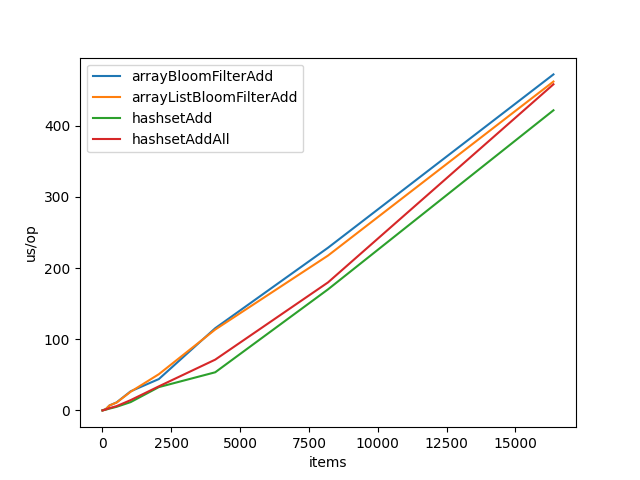
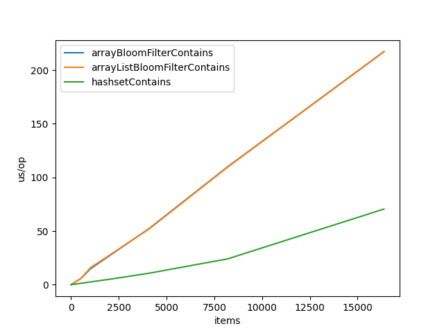

# Simple Bloom Filter implementation in java
## References:
- https://fr.wikipedia.org/wiki/Filtre_de_Bloom
- https://llimllib.github.io/bloomfilter-tutorial/
- https://fr.wikipedia.org/wiki/Fonction_de_hachage
- https://www.geeksforgeeks.org/bloom-filters-introduction-and-python-implementation/
- https://andybui01.github.io/bloom-filter/#implementation-and-benchmarks

### hash functions
- https://sites.google.com/site/murmurhash/
- https://gist.github.com/sgsfak/9ba382a0049f6ee885f68621ae86079b

### micro benchmarking
- https://stackoverflow.com/questions/51232809/performance-comparison-of-modulo-operator-and-bitwise-and
- https://stackoverflow.com/questions/504103/how-do-i-write-a-correct-micro-benchmark-in-java
- https://www.baeldung.com/java-microbenchmark-harness
- https://www.loicmathieu.fr/wordpress/informatique/introduction-a-jmh-java-microbenchmark-harness/
- http://leogomes.github.io/assets/JMH_cheatsheet.pdf

## how to run
Unit tests and Benchmarks
```bash
mvn test 
```

## Optimisations
> Benchmarks are all done with the same haashFunctions arrayList, but it might not be 
> the same as the one currently pushed on the repo. 

### From Object to byte[]
At first, I used a stack overflow answer to go from an Object to byte[], this is the code in Utils.objectToBytes().
```java
public static byte[] objectToBytes(Object object) {
    try (ByteArrayOutputStream bos = new ByteArrayOutputStream(); ObjectOutputStream oos = new ObjectOutputStream(bos)) {
        oos.writeObject(object);
        return bos.toByteArray();
    } catch (IOException e) {
        throw new RuntimeException(e);
    }
}
```
but, after doing the BloomFilter benchmarks, I found that I was much slower than java's HashSet, even when only using one hash function, 
the same one used in the HashSet, so it couldn't be my hash functions fault. After some more digging, this is the implementation most java BloomFilters use.
```java
public static byte[] objectToStringToBytes(Object object) {
    if(object == null) {
        return new byte[]{}; // null is represented by an empty byte array
    }

    // no need for .toString() when object is already a String
    if(object instanceof String) {
        return ((String) object).getBytes(StandardCharsets.UTF_8);
    }

    return object.toString().getBytes(StandardCharsets.UTF_8);
}
```
This proved to be much faster, about a 10x speedup.

```text
Benchmark                                         Mode  Cnt  Score   Error  Units
ObjectToByteArrayBenchmark.serilizationDouble     avgt    5  0.647 ± 0.019  us/op
ObjectToByteArrayBenchmark.serilizationInteger    avgt    5  0.640 ± 0.020  us/op
ObjectToByteArrayBenchmark.serilizationString     avgt    5  0.452 ± 0.015  us/op
ObjectToByteArrayBenchmark.stringGetBytesDouble   avgt    5  0.098 ± 0.005  us/op
ObjectToByteArrayBenchmark.stringGetBytesInteger  avgt    5  0.055 ± 0.005  us/op
ObjectToByteArrayBenchmark.stringGetBytesString   avgt    5  0.072 ± 0.006  us/op
```

### murmurHash2 Optimizations

Loading **4 bytes** into **int** optimisation
```java
// going from 
int k = ByteBuffer.wrap(Arrays.copyOfRange(data, i, i+4)).getInt();
// to
int k = ByteBuffer.wrap(data, i, 4);
```
```text
Benchmark                              (size)  Mode  Cnt     Score    Error  Units
Bencher.arrayBloomFilterAdd                10  avgt    5    13.307 ±  0.639  us/op
Bencher.arrayBloomFilterAdd              1000  avgt    5    13.473 ±  1.042  us/op
Bencher.arrayBloomFilterAdd            100000  avgt    5    14.225 ±  0.227  us/op
Bencher.arrayBloomFilterContains           10  avgt    5    13.281 ±  0.356  us/op
Bencher.arrayBloomFilterContains         1000  avgt    5    12.992 ±  3.369  us/op
Bencher.arrayBloomFilterContains       100000  avgt    5    14.173 ±  0.418  us/op
Bencher.arrayListBloomFilterAdd            10  avgt    5    12.764 ±  3.911  us/op
Bencher.arrayListBloomFilterAdd          1000  avgt    5    12.061 ±  4.064  us/op
Bencher.arrayListBloomFilterAdd        100000  avgt    5    14.098 ±  0.139  us/op
Bencher.arrayListBloomFilterContains       10  avgt    5    12.617 ±  3.500  us/op
Bencher.arrayListBloomFilterContains     1000  avgt    5    13.379 ±  0.234  us/op
Bencher.arrayListBloomFilterContains   100000  avgt    5    14.264 ±  0.260  us/op
Bencher.linkedListBloomFilterAdd           10  avgt    5    13.033 ±  2.599  us/op
Bencher.linkedListBloomFilterAdd         1000  avgt    5    24.772 ±  0.117  us/op
Bencher.linkedListBloomFilterAdd       100000  avgt    5  1275.189 ± 35.425  us/op
Bencher.linkedListBloomFilterContains      10  avgt    5    12.811 ±  5.370  us/op
Bencher.linkedListBloomFilterContains    1000  avgt    5    22.341 ±  1.643  us/op
Bencher.linkedListBloomFilterContains  100000  avgt    5  1288.736 ± 64.979  us/op
```
to
```text
Benchmark                              (size)  Mode  Cnt     Score    Error  Units
Bencher.arrayBloomFilterAdd                10  avgt    5    11.430 ±  5.403  us/op
Bencher.arrayBloomFilterAdd              1000  avgt    5    11.303 ±  4.107  us/op
Bencher.arrayBloomFilterAdd            100000  avgt    5    12.632 ±  1.905  us/op
Bencher.arrayBloomFilterContains           10  avgt    5    11.860 ±  0.813  us/op
Bencher.arrayBloomFilterContains         1000  avgt    5    11.161 ±  6.221  us/op
Bencher.arrayBloomFilterContains       100000  avgt    5    12.710 ±  0.513  us/op
Bencher.arrayListBloomFilterAdd            10  avgt    5    10.126 ±  4.166  us/op
Bencher.arrayListBloomFilterAdd          1000  avgt    5    11.106 ±  3.977  us/op
Bencher.arrayListBloomFilterAdd        100000  avgt    5    12.666 ±  1.566  us/op
Bencher.arrayListBloomFilterContains       10  avgt    5    10.920 ±  5.341  us/op
Bencher.arrayListBloomFilterContains     1000  avgt    5    10.982 ±  5.409  us/op
Bencher.arrayListBloomFilterContains   100000  avgt    5    12.501 ±  1.873  us/op
Bencher.linkedListBloomFilterAdd           10  avgt    5    10.365 ±  4.681  us/op
Bencher.linkedListBloomFilterAdd         1000  avgt    5    23.979 ±  0.258  us/op
Bencher.linkedListBloomFilterAdd       100000  avgt    5  1273.741 ± 29.381  us/op
Bencher.linkedListBloomFilterContains      10  avgt    5    10.893 ±  5.591  us/op
Bencher.linkedListBloomFilterContains    1000  avgt    5    24.021 ±  0.493  us/op
Bencher.linkedListBloomFilterContains  100000  avgt    5  1275.462 ± 59.471  us/op
```

Then, tried to improve further by removing the allocation of a new ByteBuffer
```java
// going from 
int k = ByteBuffer.wrap(data, i, 4);
// to
int k = data[i]
        + data[i+1] << 8
        + data[i+2] << 16
        + data[i+3] << 24;
```
```text
Benchmark                              (size)  Mode  Cnt    Score    Error  Units
Bencher.arrayBloomFilterAdd                10  avgt    5    9.258 ±  0.491  us/op
Bencher.arrayBloomFilterAdd              1000  avgt    5    9.137 ±  0.704  us/op
Bencher.arrayBloomFilterAdd            100000  avgt    5    9.272 ±  0.160  us/op
Bencher.arrayBloomFilterContains           10  avgt    5    9.222 ±  0.485  us/op
Bencher.arrayBloomFilterContains         1000  avgt    5    9.229 ±  0.324  us/op
Bencher.arrayBloomFilterContains       100000  avgt    5    9.275 ±  0.332  us/op
Bencher.arrayListBloomFilterAdd            10  avgt    5    9.105 ±  0.525  us/op
Bencher.arrayListBloomFilterAdd          1000  avgt    5    9.167 ±  0.350  us/op
Bencher.arrayListBloomFilterAdd        100000  avgt    5    9.297 ±  0.442  us/op
Bencher.arrayListBloomFilterContains       10  avgt    5    9.198 ±  0.311  us/op
Bencher.arrayListBloomFilterContains     1000  avgt    5    9.224 ±  0.532  us/op
Bencher.arrayListBloomFilterContains   100000  avgt    5    9.256 ±  0.107  us/op
Bencher.linkedListBloomFilterAdd           10  avgt    5    9.286 ±  0.425  us/op
Bencher.linkedListBloomFilterAdd         1000  avgt    5   17.757 ±  0.438  us/op
Bencher.linkedListBloomFilterAdd       100000  avgt    5  618.787 ± 39.022  us/op
Bencher.linkedListBloomFilterContains      10  avgt    5    9.566 ±  0.896  us/op
Bencher.linkedListBloomFilterContains    1000  avgt    5   18.062 ±  0.483  us/op
Bencher.linkedListBloomFilterContains  100000  avgt    5  623.874 ± 30.746  us/op
```
we got a lot faster.

### BloomFilter optimizations
The mightContain() method's code was
```java
public boolean mightContain(T value) {
    boolean all_true = true;
    for (ToIntFunction<T> hashFunction: this.hashFunctions) {
        int pos = hashFunction.applyAsInt(value);
        boolean v = bits.get(positiveMod(pos, bits.size()));
        all_true = all_true && v;
    }

    return all_true;
}
```
changed to
```java
public boolean mightContain(T value) {
    boolean all_true = true;
    for (int i=0; all_true && i<this.hashFunctions.size(); i++) {
        ToIntFunction<T> hashFunction = this.hashFunctions.get(i);
        int pos = hashFunction.applyAsInt(value);
        all_true = bits.get(positiveMod(pos, bits.size()));
    }

    return all_true;
}
```
This provided a 20% performance boost across the board. (baseline is hashset contains from java's collections)


C style for loops tend to be faster than iterator based ones, 
this could explain the performance gain but i don't think it's the only factor here.

## Full Benchmark




```text
Benchmark                              (items)  Mode  Cnt         Score         Error  Units
Bencher.arrayBloomFilterAdd                  2  avgt    5         0.081 ±       0.049  us/op
Bencher.arrayBloomFilterAdd                  4  avgt    5         0.088 ±       0.010  us/op
Bencher.arrayBloomFilterAdd                  8  avgt    5         0.151 ±       0.005  us/op
Bencher.arrayBloomFilterAdd                 16  avgt    5         0.273 ±       0.006  us/op
Bencher.arrayBloomFilterAdd                 32  avgt    5         0.531 ±       0.044  us/op
Bencher.arrayBloomFilterAdd                 64  avgt    5         1.039 ±       0.015  us/op
Bencher.arrayBloomFilterAdd                128  avgt    5         2.102 ±       0.120  us/op
Bencher.arrayBloomFilterAdd                256  avgt    5         7.057 ±       0.273  us/op
Bencher.arrayBloomFilterAdd                512  avgt    5        11.248 ±       0.991  us/op
Bencher.arrayBloomFilterAdd               1024  avgt    5        26.893 ±      10.282  us/op
Bencher.arrayBloomFilterAdd               2048  avgt    5        44.112 ±      28.364  us/op
Bencher.arrayBloomFilterAdd               4096  avgt    5       115.564 ±       8.249  us/op
Bencher.arrayBloomFilterAdd               8192  avgt    5       228.621 ±       8.352  us/op
Bencher.arrayBloomFilterAdd              16384  avgt    5       472.268 ±      48.387  us/op
Bencher.arrayBloomFilterContains             2  avgt    5         0.044 ±       0.020  us/op
Bencher.arrayBloomFilterContains             4  avgt    5         0.093 ±       0.090  us/op
Bencher.arrayBloomFilterContains             8  avgt    5         0.166 ±       0.046  us/op
Bencher.arrayBloomFilterContains            16  avgt    5         0.258 ±       0.041  us/op
Bencher.arrayBloomFilterContains            32  avgt    5         0.413 ±       0.063  us/op
Bencher.arrayBloomFilterContains            64  avgt    5         0.756 ±       0.138  us/op
Bencher.arrayBloomFilterContains           128  avgt    5         1.493 ±       0.073  us/op
Bencher.arrayBloomFilterContains           256  avgt    5         3.011 ±       0.149  us/op
Bencher.arrayBloomFilterContains           512  avgt    5         5.761 ±       0.148  us/op
Bencher.arrayBloomFilterContains          1024  avgt    5        15.035 ±       8.885  us/op
Bencher.arrayBloomFilterContains          2048  avgt    5        27.505 ±      16.572  us/op
Bencher.arrayBloomFilterContains          4096  avgt    5        52.529 ±       3.727  us/op
Bencher.arrayBloomFilterContains          8192  avgt    5       109.862 ±       6.366  us/op
Bencher.arrayBloomFilterContains         16384  avgt    5       217.261 ±      15.616  us/op
Bencher.arrayListBloomFilterAdd              2  avgt    5         0.073 ±       0.060  us/op
Bencher.arrayListBloomFilterAdd              4  avgt    5         0.093 ±       0.018  us/op
Bencher.arrayListBloomFilterAdd              8  avgt    5         0.152 ±       0.008  us/op
Bencher.arrayListBloomFilterAdd             16  avgt    5         0.273 ±       0.006  us/op
Bencher.arrayListBloomFilterAdd             32  avgt    5         0.520 ±       0.007  us/op
Bencher.arrayListBloomFilterAdd             64  avgt    5         1.032 ±       0.015  us/op
Bencher.arrayListBloomFilterAdd            128  avgt    5         2.102 ±       0.056  us/op
Bencher.arrayListBloomFilterAdd            256  avgt    5         7.023 ±       0.171  us/op
Bencher.arrayListBloomFilterAdd            512  avgt    5        11.077 ±       0.063  us/op
Bencher.arrayListBloomFilterAdd           1024  avgt    5        26.298 ±       9.714  us/op
Bencher.arrayListBloomFilterAdd           2048  avgt    5        50.949 ±      36.986  us/op
Bencher.arrayListBloomFilterAdd           4096  avgt    5       113.697 ±       0.976  us/op
Bencher.arrayListBloomFilterAdd           8192  avgt    5       217.613 ±      95.874  us/op
Bencher.arrayListBloomFilterAdd          16384  avgt    5       462.217 ±      49.030  us/op
Bencher.arrayListBloomFilterContains         2  avgt    5         0.041 ±       0.008  us/op
Bencher.arrayListBloomFilterContains         4  avgt    5         0.096 ±       0.084  us/op
Bencher.arrayListBloomFilterContains         8  avgt    5         0.156 ±       0.044  us/op
Bencher.arrayListBloomFilterContains        16  avgt    5         0.267 ±       0.068  us/op
Bencher.arrayListBloomFilterContains        32  avgt    5         0.405 ±       0.045  us/op
Bencher.arrayListBloomFilterContains        64  avgt    5         0.741 ±       0.016  us/op
Bencher.arrayListBloomFilterContains       128  avgt    5         1.488 ±       0.029  us/op
Bencher.arrayListBloomFilterContains       256  avgt    5         3.006 ±       0.095  us/op
Bencher.arrayListBloomFilterContains       512  avgt    5         5.767 ±       0.181  us/op
Bencher.arrayListBloomFilterContains      1024  avgt    5        16.038 ±       7.986  us/op
Bencher.arrayListBloomFilterContains      2048  avgt    5        27.967 ±      11.579  us/op
Bencher.arrayListBloomFilterContains      4096  avgt    5        52.194 ±       1.713  us/op
Bencher.arrayListBloomFilterContains      8192  avgt    5       109.572 ±       4.802  us/op
Bencher.arrayListBloomFilterContains     16384  avgt    5       217.260 ±      20.065  us/op
Bencher.hashsetAdd                           2  avgt    5         0.054 ±       0.011  us/op
Bencher.hashsetAdd                           4  avgt    5         0.058 ±       0.006  us/op
Bencher.hashsetAdd                           8  avgt    5         0.101 ±       0.023  us/op
Bencher.hashsetAdd                          16  avgt    5         0.154 ±       0.019  us/op
Bencher.hashsetAdd                          32  avgt    5         0.301 ±       0.066  us/op
Bencher.hashsetAdd                          64  avgt    5         0.579 ±       0.018  us/op
Bencher.hashsetAdd                         128  avgt    5         1.184 ±       0.057  us/op
Bencher.hashsetAdd                         256  avgt    5         2.572 ±       0.351  us/op
Bencher.hashsetAdd                         512  avgt    5         5.078 ±       2.562  us/op
Bencher.hashsetAdd                        1024  avgt    5        11.732 ±       9.498  us/op
Bencher.hashsetAdd                        2048  avgt    5        32.809 ±       1.747  us/op
Bencher.hashsetAdd                        4096  avgt    5        53.625 ±      41.128  us/op
Bencher.hashsetAdd                        8192  avgt    5       170.125 ±      62.928  us/op
Bencher.hashsetAdd                       16384  avgt    5       421.839 ±     101.503  us/op
Bencher.hashsetAddAll                        2  avgt    5         0.053 ±       0.008  us/op
Bencher.hashsetAddAll                        4  avgt    5         0.071 ±       0.009  us/op
Bencher.hashsetAddAll                        8  avgt    5         0.113 ±       0.026  us/op
Bencher.hashsetAddAll                       16  avgt    5         0.191 ±       0.028  us/op
Bencher.hashsetAddAll                       32  avgt    5         0.359 ±       0.043  us/op
Bencher.hashsetAddAll                       64  avgt    5         0.715 ±       0.066  us/op
Bencher.hashsetAddAll                      128  avgt    5         1.463 ±       0.130  us/op
Bencher.hashsetAddAll                      256  avgt    5         3.272 ±       0.378  us/op
Bencher.hashsetAddAll                      512  avgt    5         6.020 ±       0.317  us/op
Bencher.hashsetAddAll                     1024  avgt    5        14.532 ±       5.166  us/op
Bencher.hashsetAddAll                     2048  avgt    5        33.857 ±      10.684  us/op
Bencher.hashsetAddAll                     4096  avgt    5        71.400 ±      14.024  us/op
Bencher.hashsetAddAll                     8192  avgt    5       179.896 ±      31.606  us/op
Bencher.hashsetAddAll                    16384  avgt    5       458.357 ±      61.750  us/op
Bencher.hashsetContains                      2  avgt    5         0.025 ±       0.003  us/op
Bencher.hashsetContains                      4  avgt    5         0.027 ±       0.038  us/op
Bencher.hashsetContains                      8  avgt    5         0.083 ±       0.102  us/op
Bencher.hashsetContains                     16  avgt    5         0.052 ±       0.009  us/op
Bencher.hashsetContains                     32  avgt    5         0.098 ±       0.018  us/op
Bencher.hashsetContains                     64  avgt    5         0.186 ±       0.009  us/op
Bencher.hashsetContains                    128  avgt    5         0.416 ±       0.529  us/op
Bencher.hashsetContains                    256  avgt    5         0.670 ±       0.044  us/op
Bencher.hashsetContains                    512  avgt    5         1.332 ±       0.020  us/op
Bencher.hashsetContains                   1024  avgt    5         2.645 ±       0.076  us/op
Bencher.hashsetContains                   2048  avgt    5         5.187 ±       0.107  us/op
Bencher.hashsetContains                   4096  avgt    5        10.783 ±       0.315  us/op
Bencher.hashsetContains                   8192  avgt    5        24.066 ±       1.057  us/op
Bencher.hashsetContains                  16384  avgt    5        70.553 ±      14.361  us/op
Bencher.linkedListBloomFilterAdd             2  avgt    5         0.616 ±       0.887  us/op
Bencher.linkedListBloomFilterAdd             4  avgt    5         3.209 ±       2.292  us/op
Bencher.linkedListBloomFilterAdd             8  avgt    5        12.504 ±       9.490  us/op
Bencher.linkedListBloomFilterAdd            16  avgt    5        56.414 ±      40.689  us/op
Bencher.linkedListBloomFilterAdd            32  avgt    5       255.670 ±      40.417  us/op
Bencher.linkedListBloomFilterAdd            64  avgt    5       964.564 ±     220.519  us/op
Bencher.linkedListBloomFilterAdd           128  avgt    5      4239.690 ±     658.224  us/op
Bencher.linkedListBloomFilterAdd           256  avgt    5     16757.271 ±    1580.770  us/op
Bencher.linkedListBloomFilterAdd           512  avgt    5     66382.430 ±    6115.935  us/op
Bencher.linkedListBloomFilterAdd          1024  avgt    5    263058.967 ±   22518.553  us/op
Bencher.linkedListBloomFilterAdd          2048  avgt    5   1068541.092 ±   58288.794  us/op
Bencher.linkedListBloomFilterAdd          4096  avgt    5   4611675.733 ±  279944.646  us/op
Bencher.linkedListBloomFilterAdd          8192  avgt    5  18069059.200 ±  327683.405  us/op
Bencher.linkedListBloomFilterAdd         16384  avgt    5  72941913.075 ± 1129443.321  us/op
Bencher.linkedListBloomFilterContains        2  avgt    5         0.404 ±       0.467  us/op
Bencher.linkedListBloomFilterContains        4  avgt    5         1.431 ±       1.427  us/op
Bencher.linkedListBloomFilterContains        8  avgt    5         6.929 ±       6.737  us/op
Bencher.linkedListBloomFilterContains       16  avgt    5        35.448 ±      20.671  us/op
Bencher.linkedListBloomFilterContains       32  avgt    5       148.612 ±      38.497  us/op
Bencher.linkedListBloomFilterContains       64  avgt    5       605.908 ±     227.478  us/op
Bencher.linkedListBloomFilterContains      128  avgt    5      2475.805 ±     339.585  us/op
Bencher.linkedListBloomFilterContains      256  avgt    5      9341.676 ±     705.833  us/op
Bencher.linkedListBloomFilterContains      512  avgt    5     37868.172 ±    5829.600  us/op
Bencher.linkedListBloomFilterContains     1024  avgt    5    170570.269 ±  112821.033  us/op
Bencher.linkedListBloomFilterContains     2048  avgt    5    616705.125 ±   22728.137  us/op
Bencher.linkedListBloomFilterContains     4096  avgt    5   2849123.733 ±  146752.620  us/op
Bencher.linkedListBloomFilterContains     8192  avgt    5  12511660.275 ±  322708.582  us/op
Bencher.linkedListBloomFilterContains    16384  avgt    5  49278010.883 ±  986055.460  us/op
```