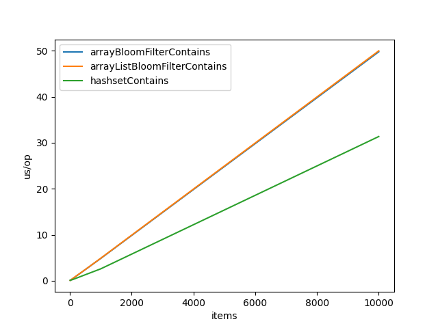
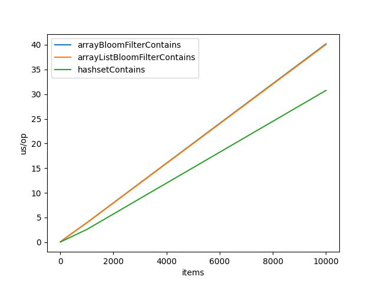
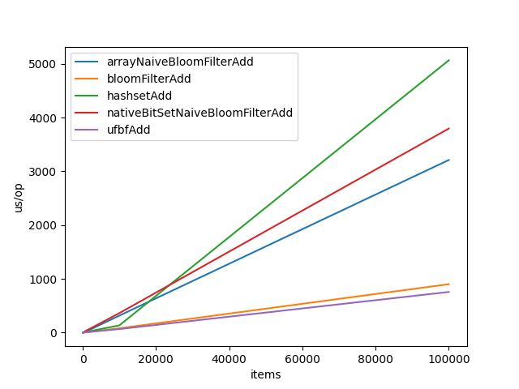
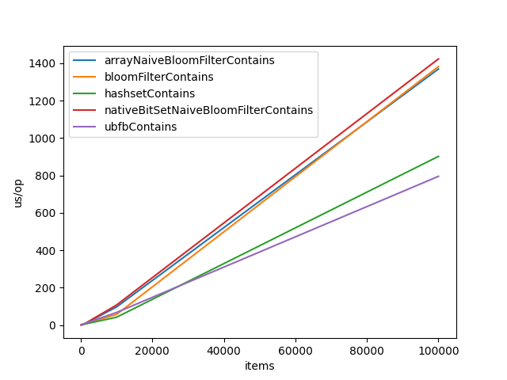
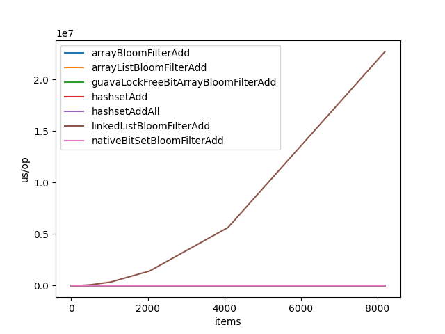
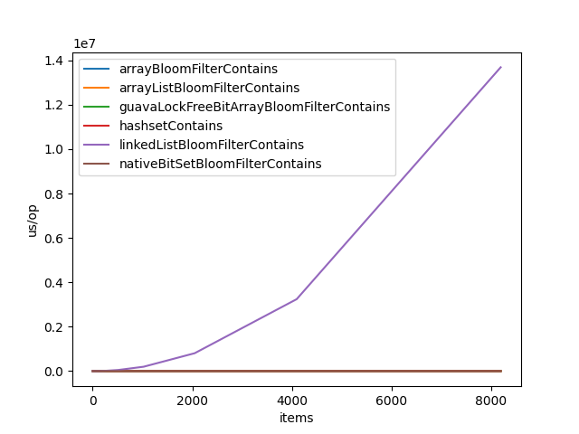
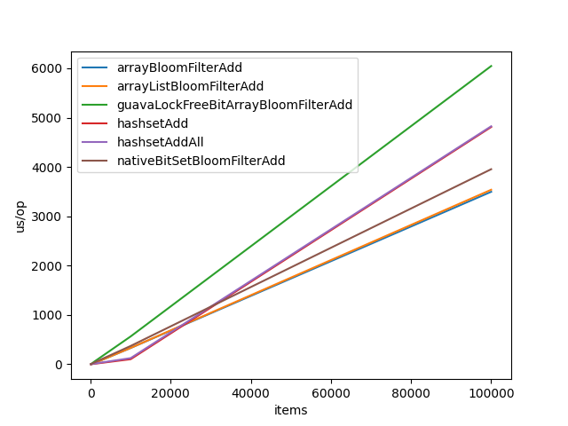
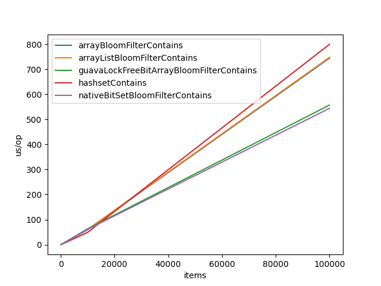

# Simple Bloom Filter implementation in java
## References:
- https://fr.wikipedia.org/wiki/Filtre_de_Bloom
- https://llimllib.github.io/bloomfilter-tutorial/
- https://fr.wikipedia.org/wiki/Fonction_de_hachage
- https://www.geeksforgeeks.org/bloom-filters-introduction-and-python-implementation/
- https://andybui01.github.io/bloom-filter/#implementation-and-benchmarks // for formulas
- https://github.com/andybui01/Bloom/blob/main/include/bloom/bloom.h
- https://github.com/eugenp/tutorials/blob/master/guava-modules/guava-utilities/src/test/java/com/baeldung/guava/bloomfilter/BloomFilterUnitTest.java # usage of guava's bloom filter
- https://github.com/google/guava/blob/master/guava/src/com/google/common/hash/BloomFilterStrategies.java # guava's bloom filter's strategies

### hash functions
- https://sites.google.com/site/murmurhash/
- https://gist.github.com/sgsfak/9ba382a0049f6ee885f68621ae86079b

### micro benchmarking
- https://stackoverflow.com/questions/51232809/performance-comparison-of-modulo-operator-and-bitwise-and
- https://stackoverflow.com/questions/504103/how-do-i-write-a-correct-micro-benchmark-in-java
- https://www.baeldung.com/java-microbenchmark-harness
- https://www.loicmathieu.fr/wordpress/informatique/introduction-a-jmh-java-microbenchmark-harness/
- http://leogomes.github.io/assets/JMH_cheatsheet.pdf
- https://github.com/guozheng/jmh-tutorial // for the jar build

## how to run

run benchmarks
```bash
mvn clean install

java --add-modules jdk.incubator.vector -jar target/benchmarks.jar # for all benchmarks
# or
java --add-modules jdk.incubator.vector -jar target/benchmarks.jar com.leikoe.Bencher # for only bloom filter benchmarks
java --add-modules jdk.incubator.vector -jar target/benchmarks.jar com.leikoe.ObjectToByte # for only ObjectToBytes benchmarks
```

Unit tests
```bash
mvn test 
```

## Optimisations
> Benchmarks are all done with the same haashFunctions arrayList, but it might not be 
> the same as the one currently pushed on the repo. 

### From Object to byte[]
At first, I used a stack overflow answer to go from an Object to byte[], this is the code in Utils.objectToBytes().
```java
public static byte[] objectToBytes(Object object) {
    try (ByteArrayOutputStream bos = new ByteArrayOutputStream(); ObjectOutputStream oos = new ObjectOutputStream(bos)) {
        oos.writeObject(object);
        return bos.toByteArray();
    } catch (IOException e) {
        throw new RuntimeException(e);
    }
}
```
but, after doing the BloomFilter benchmarks, I found that I was much slower than java's HashSet, even when only using one hash function, 
the same one used in the HashSet, so it couldn't be my hash functions fault. After some more digging, this is the implementation most java BloomFilters use.
```java
public static byte[] objectToStringToBytes(Object object) {
    if(object == null) {
        return new byte[]{}; // null is represented by an empty byte array
    }

    // no need for .toString() when object is already a String
    if(object instanceof String) {
        return ((String) object).getBytes(StandardCharsets.UTF_8);
    }

    return object.toString().getBytes(StandardCharsets.UTF_8);
}
```
This proved to be much faster, about a 10x speedup.

```text
Benchmark                                         Mode  Cnt  Score   Error  Units
ObjectToByteArrayBenchmark.serilizationDouble     avgt    5  0.647 ± 0.019  us/op
ObjectToByteArrayBenchmark.serilizationInteger    avgt    5  0.640 ± 0.020  us/op
ObjectToByteArrayBenchmark.serilizationString     avgt    5  0.452 ± 0.015  us/op
ObjectToByteArrayBenchmark.stringGetBytesDouble   avgt    5  0.098 ± 0.005  us/op
ObjectToByteArrayBenchmark.stringGetBytesInteger  avgt    5  0.055 ± 0.005  us/op
ObjectToByteArrayBenchmark.stringGetBytesString   avgt    5  0.072 ± 0.006  us/op
```

### murmurHash2 Optimizations

Loading **4 bytes** into **int** optimisation
```java
// going from 
int k = ByteBuffer.wrap(Arrays.copyOfRange(data, i, i+4)).getInt();
// to
int k = ByteBuffer.wrap(data, i, 4);
```
```text
Benchmark                              (size)  Mode  Cnt     Score    Error  Units
Bencher.arrayBloomFilterAdd                10  avgt    5    13.307 ±  0.639  us/op
Bencher.arrayBloomFilterAdd              1000  avgt    5    13.473 ±  1.042  us/op
Bencher.arrayBloomFilterAdd            100000  avgt    5    14.225 ±  0.227  us/op
Bencher.arrayBloomFilterContains           10  avgt    5    13.281 ±  0.356  us/op
Bencher.arrayBloomFilterContains         1000  avgt    5    12.992 ±  3.369  us/op
Bencher.arrayBloomFilterContains       100000  avgt    5    14.173 ±  0.418  us/op
Bencher.arrayListBloomFilterAdd            10  avgt    5    12.764 ±  3.911  us/op
Bencher.arrayListBloomFilterAdd          1000  avgt    5    12.061 ±  4.064  us/op
Bencher.arrayListBloomFilterAdd        100000  avgt    5    14.098 ±  0.139  us/op
Bencher.arrayListBloomFilterContains       10  avgt    5    12.617 ±  3.500  us/op
Bencher.arrayListBloomFilterContains     1000  avgt    5    13.379 ±  0.234  us/op
Bencher.arrayListBloomFilterContains   100000  avgt    5    14.264 ±  0.260  us/op
Bencher.linkedListBloomFilterAdd           10  avgt    5    13.033 ±  2.599  us/op
Bencher.linkedListBloomFilterAdd         1000  avgt    5    24.772 ±  0.117  us/op
Bencher.linkedListBloomFilterAdd       100000  avgt    5  1275.189 ± 35.425  us/op
Bencher.linkedListBloomFilterContains      10  avgt    5    12.811 ±  5.370  us/op
Bencher.linkedListBloomFilterContains    1000  avgt    5    22.341 ±  1.643  us/op
Bencher.linkedListBloomFilterContains  100000  avgt    5  1288.736 ± 64.979  us/op
```
to
```text
Benchmark                              (size)  Mode  Cnt     Score    Error  Units
Bencher.arrayBloomFilterAdd                10  avgt    5    11.430 ±  5.403  us/op
Bencher.arrayBloomFilterAdd              1000  avgt    5    11.303 ±  4.107  us/op
Bencher.arrayBloomFilterAdd            100000  avgt    5    12.632 ±  1.905  us/op
Bencher.arrayBloomFilterContains           10  avgt    5    11.860 ±  0.813  us/op
Bencher.arrayBloomFilterContains         1000  avgt    5    11.161 ±  6.221  us/op
Bencher.arrayBloomFilterContains       100000  avgt    5    12.710 ±  0.513  us/op
Bencher.arrayListBloomFilterAdd            10  avgt    5    10.126 ±  4.166  us/op
Bencher.arrayListBloomFilterAdd          1000  avgt    5    11.106 ±  3.977  us/op
Bencher.arrayListBloomFilterAdd        100000  avgt    5    12.666 ±  1.566  us/op
Bencher.arrayListBloomFilterContains       10  avgt    5    10.920 ±  5.341  us/op
Bencher.arrayListBloomFilterContains     1000  avgt    5    10.982 ±  5.409  us/op
Bencher.arrayListBloomFilterContains   100000  avgt    5    12.501 ±  1.873  us/op
Bencher.linkedListBloomFilterAdd           10  avgt    5    10.365 ±  4.681  us/op
Bencher.linkedListBloomFilterAdd         1000  avgt    5    23.979 ±  0.258  us/op
Bencher.linkedListBloomFilterAdd       100000  avgt    5  1273.741 ± 29.381  us/op
Bencher.linkedListBloomFilterContains      10  avgt    5    10.893 ±  5.591  us/op
Bencher.linkedListBloomFilterContains    1000  avgt    5    24.021 ±  0.493  us/op
Bencher.linkedListBloomFilterContains  100000  avgt    5  1275.462 ± 59.471  us/op
```

Then, tried to improve further by removing the allocation of a new ByteBuffer
```java
// going from 
int k = ByteBuffer.wrap(data, i, 4);
// to
int k = data[i]
        + data[i+1] << 8
        + data[i+2] << 16
        + data[i+3] << 24;
```
```text
Benchmark                              (size)  Mode  Cnt    Score    Error  Units
Bencher.arrayBloomFilterAdd                10  avgt    5    9.258 ±  0.491  us/op
Bencher.arrayBloomFilterAdd              1000  avgt    5    9.137 ±  0.704  us/op
Bencher.arrayBloomFilterAdd            100000  avgt    5    9.272 ±  0.160  us/op
Bencher.arrayBloomFilterContains           10  avgt    5    9.222 ±  0.485  us/op
Bencher.arrayBloomFilterContains         1000  avgt    5    9.229 ±  0.324  us/op
Bencher.arrayBloomFilterContains       100000  avgt    5    9.275 ±  0.332  us/op
Bencher.arrayListBloomFilterAdd            10  avgt    5    9.105 ±  0.525  us/op
Bencher.arrayListBloomFilterAdd          1000  avgt    5    9.167 ±  0.350  us/op
Bencher.arrayListBloomFilterAdd        100000  avgt    5    9.297 ±  0.442  us/op
Bencher.arrayListBloomFilterContains       10  avgt    5    9.198 ±  0.311  us/op
Bencher.arrayListBloomFilterContains     1000  avgt    5    9.224 ±  0.532  us/op
Bencher.arrayListBloomFilterContains   100000  avgt    5    9.256 ±  0.107  us/op
Bencher.linkedListBloomFilterAdd           10  avgt    5    9.286 ±  0.425  us/op
Bencher.linkedListBloomFilterAdd         1000  avgt    5   17.757 ±  0.438  us/op
Bencher.linkedListBloomFilterAdd       100000  avgt    5  618.787 ± 39.022  us/op
Bencher.linkedListBloomFilterContains      10  avgt    5    9.566 ±  0.896  us/op
Bencher.linkedListBloomFilterContains    1000  avgt    5   18.062 ±  0.483  us/op
Bencher.linkedListBloomFilterContains  100000  avgt    5  623.874 ± 30.746  us/op
```
we got a lot faster.

### BloomFilter optimizations
The mightContain() method's code was
```java
public boolean mightContain(T value) {
    boolean all_true = true;
    for (ToIntFunction<T> hashFunction: this.hashFunctions) {
        int pos = hashFunction.applyAsInt(value);
        boolean v = bits.get(positiveMod(pos, bits.size()));
        all_true = all_true && v;
    }

    return all_true;
}
```
changed to
```java
public boolean mightContain(T value) {
    boolean all_true = true;
    for (int i=0; all_true && i<this.hashFunctions.size(); i++) {
        ToIntFunction<T> hashFunction = this.hashFunctions.get(i);
        int pos = hashFunction.applyAsInt(value);
        all_true = bits.get(positiveMod(pos, bits.size()));
    }

    return all_true;
}
```
This provided a 20% performance boost across the board. (baseline is hashset contains from java's collections)




C style for loops tend to be faster than iterator based ones, 
this could explain the performance gain but i don't think it's the only factor here.

Then looking at some other implementations and reading papers (such as "Vectorized Bloom Filters for Advanced SIMD Processors"), I understood that we didn't need K hash functions, we just needed two base ones and then bishift + multiply would work for the next k-2 functions.
With this knowlegde, I produced the following code:
```java
public boolean mightContain(T value) {
        long[] hashes = new long[]{0, 0};

        boolean all_true = true;
        for (int i=0; all_true && i<this.k; i++) {
            long pos = hash(hashes, value, i);
            all_true = bits.get(positiveMod(pos, bits.size()));
        }

        return all_true;
}
```

Which i then optimized by removing the allocation:
```java
public boolean mightContain(T value) {
        hashes[0] = 0;
        hashes[1] = 0;

        boolean all_true = true;
        for (int i=0; all_true && i<this.k; i++) {
            long pos = hash(hashes, value, i);
            all_true = bits.get(positiveMod(pos, bits.size()));
        }

        return all_true;
}
```
and adding a long[] hashes in the class attributes, which gets allocated and initialized in the constructor.

Removing the allocation provided the following speedup:
```text
Bencher.arrayBloomFilterAdd                          8192  avgt    5       559.725 ±     21.785  us/op
Bencher.arrayBloomFilterContains                     8192  avgt    5       178.845 ±     27.856  us/op
```
to 
```text
Bencher.arrayBloomFilterAdd                          8192  avgt    5       308.701 ±     35.437  us/op
Bencher.arrayBloomFilterContains                     8192  avgt    5        93.384 ±     60.560  us/op
```
about a 2x speedup.

Then, removed the hashes long array reset in each call, because it was overriden by the first and second hash() calls before being used.

```text
Bencher.arrayBloomFilterAdd                          8192  avgt    5       308.701 ±     35.437  us/op
Bencher.arrayBloomFilterContains                     8192  avgt    5        93.384 ±     60.560  us/op
```
to
```text
Bencher.arrayBloomFilterAdd                          8192  avgt    5  297.222 ±  9.343  us/op
Bencher.arrayBloomFilterContains                     8192  avgt    5   88.677 ± 30.999  us/op
```

This provided little improvement across the board for all benchmarks.

inlining the two hashfunctions allowed for reusing result for the second one, (using hashCode() and hashMapHash()).
```text
Benchmark                         (items)  Mode  Cnt    Score    Error  Units
Bencher.arrayBloomFilterAdd          8192  avgt    5  142.792 ± 10.284  us/op
Bencher.arrayBloomFilterContains     8192  avgt    5   85.736 ± 17.159  us/op
```
to
```text
Benchmark                         (items)  Mode  Cnt    Score    Error  Units
Bencher.arrayBloomFilterAdd          8192  avgt    5  107.403 ± 12.855  us/op
Bencher.arrayBloomFilterContains     8192  avgt    5   73.524 ± 16.212  us/op
```
to provided a ~35% speedup for Add() and ~15% speedup for Contains().
> note: contains benefits less from this optimization as it does not run through all the hash functions when the element isn't present (%50 of the time in our bechmarks).

At this point, the bloomfilter is beating java's standard library's HashSet.

## UltraFastBloomFilter

- broadcast optimization (moved unit array creation to constructor instead of each call since its not modified)
- reducing compare operations, found out that they allocate. (using profiler)
- lt, compare and not all allocate, need to find a workaround
- the method I came up with to retain positive hash values allocates + is expensive

### fixing the positive hash values
```java
VectorMask<Integer> mask = v_combinedHash.lt(0);
v_combinedHash = v_combinedHash.blend(v_combinedHash.not(), mask);
```
this works and is the direct translation of the following in simd:
```java
// from google's guava hash implementation

// Flip all the bits if it's negative (guaranteed positive number)
if (combinedHash < 0) {
  combinedHash = ~combinedHash;
}
```
I noticed in the debugger that flipping all the bits like this gets the absolute value of the hash, which is a lot faster in smd than my implementation
> note: this might be architecture dependent
 
So I came up with this:
```java
v_combineHash = v_combineHash.abs();
```
This gave the following results when benchmarked (SimdBenchmark):

| mask + blend | 12.8 ns/op |
|--------------|------------|
| abs()        | 12.2 ns/op |

abs() runs just as fast and allocates less, while being clearer to read.

## UFBF, cache friendly

during my benchmarks, ufbf was doing worse than vectorizedBloomFilter, which wasn't supposed to happen.
after profiling, this part seemed to be the bottleneck
```java
 // process the rest in scalar code
for (; i<k; i++) {
    int pos = hash1 + ((i+1) * hash2);
    if (pos < 0) {
        pos = ~pos;
    }
    bits.set(pos % bits.size(), true);
}
```

bits.set was producing cache misses, I fixed it by reusing the block used by the vector loop above it
```java
// process the rest in scalar code
// block is a block of k ints
for (; i<k; i++) {
    int pos = hash1 + ((i+1) * hash2);
    if (pos < 0) {
        pos = ~pos;
    }
    block[i] |= 1 << pos;
}
```

this had a huge impact on performance

| ufbf.add() (cache miss)     | 2771.778 us/op  |
|-----------------------------|-----------------|
| ufbf.add() (cache friendly) | 943.710 us/op   |

## Removing abs() calls

after seeing the abs() calls in my add() and contains() functions for a while, seeing the first abs() call gave me and idea 
```java
hash1 = Math.abs(hash1);
```

since my hash function is hash2 + k * hash1, I know that if hash1 > 0 & hash2 >0, For any k > 0, hash2 + k * hash1 > 0, this eliminates the need for expesive abs calls (which even allocate in the Vector api too).


## BloomFilter optimization

after seeing the impact on performance of a cache friendly design, I decided to rename BloomFilter to NaiveBloomFilter, and make a new BloomFilter class, which would use the cache friendly design of UFBF for a scalar implementation.




We can see (in orange) that the cache friendly implementation is way faster to add elements to than the naive implementation, it comes close to the vector implementation (UFBF in purple). We could think that given how close they are, jvm vectorized our scalar code, but after printing assembly produced by HotSpot, it's clear that it didn't.

UFBF.add assembly
```asm
0x000000010aef0530:   dup	v16.4s, w0
  0x000000010aef0534:   dup	v17.4s, w17
  0x000000010aef0538:   mov	w29, wzr
  0x000000010aef053c:   movi	v18.4s, #0x1f
  0x000000010aef0540:   cmp	w29, w3
  0x000000010aef0544:   b.cs	0x000000010aef05c4  // b.hs, b.nlast
  0x000000010aef0548:   sbfiz	x12, x29, #2, #32
  0x000000010aef054c:   add	x13, x4, x12
  0x000000010aef0550:   ldr	q19, [x13, #16]
  0x000000010aef0554:   add	x12, x2, x12
  0x000000010aef0558:   ldr	q20, [x5, #16]
  0x000000010aef055c:   mov	v21.16b, v17.16b
  0x000000010aef0560:   mla	v21.4s, v19.4s, v16.4s
  0x000000010aef0564:   ldr	q19, [x12, #16]
  0x000000010aef0568:   and	v21.16b, v21.16b, v18.16b
  0x000000010aef056c:   sshl	v20.4s, v20.4s, v21.4s
  0x000000010aef0570:   cmp	w29, w6
  0x000000010aef0574:   b.cs	0x000000010aef05e0  // b.hs, b.nlast
  0x000000010aef0578:   orr	v19.16b, v20.16b, v19.16b
  0x000000010aef057c:   cmp	w29, w19
  0x000000010aef0580:   b.cs	0x000000010aef05fc  // b.hs, b.nlast
  0x000000010aef0584:   ldr	x7, [x28, #896]
  0x000000010aef0588:   str	q19, [x12, #16]
```
vs

BloomFilter.add
```asm
  0x000000010c647e0c:   nop
  0x000000010c647e10:   add	w11, w3, #0x1
  0x000000010c647e14:   madd	w12, w11, w14, w15
  0x000000010c647e18:   add	x4, x17, w3, sxtw #2
  0x000000010c647e1c:   ldr	w11, [x4, #16]
  0x000000010c647e20:   lsl	w13, w1, w12
  0x000000010c647e24:   orr	w11, w11, w13
  0x000000010c647e28:   add	w13, w3, #0x2
  0x000000010c647e2c:   str	w11, [x4, #16]
  0x000000010c647e30:   madd	w11, w13, w14, w15
  0x000000010c647e34:   ldr	w13, [x4, #20]
  0x000000010c647e38:   lsl	w11, w1, w11
  0x000000010c647e3c:   orr	w11, w13, w11
  0x000000010c647e40:   add	w13, w3, #0x3
  0x000000010c647e44:   str	w11, [x4, #20]
  0x000000010c647e48:   madd	w11, w13, w14, w15
  0x000000010c647e4c:   ldr	w12, [x4, #24]
  0x000000010c647e50:   lsl	w13, w1, w11
  0x000000010c647e54:   orr	w12, w12, w13
  0x000000010c647e58:   add	w3, w3, #0x4
  0x000000010c647e5c:   str	w12, [x4, #24]
  0x000000010c647e60:   madd	w13, w3, w14, w15
  0x000000010c647e64:   ldr	w11, [x4, #28]
  0x000000010c647e68:   lsl	w12, w1, w13
  0x000000010c647e6c:   orr	w12, w11, w12
  0x000000010c647e70:   str	w12, [x4, #28]
  0x000000010c647e74:   cmp	w3, w2
  0x000000010c647e78:   b.lt	0x000000010c647e10  // b.tstop
```
> note: This is running on an m1 mac, which uses the arm architecture, so asm isn't x86.
 
v is an alias for q in arm asm, and q is the quad word register, when it's used, we know that simd is used.
But when looking at the scalar implementation asm, we don't see any of those wide registers being used, our code wasn't vectorized.
We can highlight the use of MADD, which is the fused multiply add instruction of arm, instead of the MLA insctruction (Multiply add) which operates on vector registers (as seen in the first snippet).
Our vector implementation compiles to multiple conditional branch instructions, which might be why its not a lot faster than the scalar code.

Sadly, the membership check in scalar is much slower than the vector implementation. We can see that it's as slow as the naive approach.

With the PrintInlining option, we can see that our BloomFilter::hash function does in fact get inlined

JVM options:
```text
-Xbatch
-XX:-TieredCompilation
-XX:+UnlockDiagnosticVMOptions

// used to print assembly
-XX:CompileCommand=print,*BloomFilter.add

// used to print inlining
-XX:CompileCommand="option ,*BloomFilter.add,PrintInlining"
```

```text
@ 94   com.leikoe.UFBF::hash (10 bytes)   inline (hot)
```
hashCode also gets inlined with Murmur64::hash too:
```text
@ 1   java.lang.Integer::hashCode (8 bytes)   inline (hot)
...
@ 5   com.leikoe.hash.Murmur64::hash (35 bytes)   inline (hot)
```


## BitsContainer optimizations

according to https://stackoverflow.com/questions/605226/boolean-vs-bitset-which-is-more-efficient
> After some research, it appears that java's boolean type is more than a bit wide, java's solution is poviding us with a BitSet, which internally uses longs to store bits without wasting space.
> Taking advantage of this, I implemented NativeBitSet which implements IBitsContainer

## Tests optimizations

When using getObservedFalsePositives() in my tests, i noticed it was way slower than expected,
I initially thought it was my bloom filter being slow when checking if a given items belongs in it, but no.
It was the array list used to accumulate added values, found that out using the profiler, cpu was using 90% of it's time traversing the array list for the .contains calls.
Replaced it by an hashset and now its blazingly fast :speed: .

## Full Benchmarks
> note: all benchmarks were done on an m1 pro cpu (taking about an hour to complete), since they ran significantly slower on my i5 9600K and took 2+ hours to run.




**and without linked list**




When we look at the charts without the linked list, we can clearly see lines, which indicate a complexity of O(n), but when we add the linked list to the chart, it's a curve ! This indicates O(n^2), and the other lines look flat compared to it, even tho they are O(n).
What's weird is, we know from textbooks that linked list random access is O(n), and array/array list random access is O(1), why are we getting O(n^2) and O(n) ?
The answer is simple, since for each benchmark, we insert n elements, the compexity is multiplied by n. This gives results which explain perfectly the curves we are seeing on the charts.

```text
Benchmark                                     (items)  Mode  Cnt     Score      Error  Units
Bencher.arrayNaiveBloomFilterAdd                  100  avgt    5     1.356 ±    0.004  us/op
Bencher.arrayNaiveBloomFilterAdd                 1000  avgt    5    24.745 ±    4.636  us/op
Bencher.arrayNaiveBloomFilterAdd                10000  avgt    5   316.812 ±   19.447  us/op
Bencher.arrayNaiveBloomFilterAdd               100000  avgt    5  3211.107 ±  112.279  us/op
Bencher.arrayNaiveBloomFilterContains             100  avgt    5     0.556 ±    0.056  us/op
Bencher.arrayNaiveBloomFilterContains            1000  avgt    5     5.587 ±    0.260  us/op
Bencher.arrayNaiveBloomFilterContains           10000  avgt    5    96.779 ±    5.369  us/op
Bencher.arrayNaiveBloomFilterContains          100000  avgt    5  1369.029 ±   37.333  us/op
Bencher.bloomFilterAdd                            100  avgt    5     1.178 ±    0.007  us/op
Bencher.bloomFilterAdd                           1000  avgt    5     9.958 ±    0.113  us/op
Bencher.bloomFilterAdd                          10000  avgt    5    80.860 ±    1.696  us/op
Bencher.bloomFilterAdd                         100000  avgt    5   900.933 ±    8.218  us/op
Bencher.bloomFilterContains                       100  avgt    5     0.619 ±    0.017  us/op
Bencher.bloomFilterContains                      1000  avgt    5     5.833 ±    0.041  us/op
Bencher.bloomFilterContains                     10000  avgt    5    56.760 ±   38.589  us/op
Bencher.bloomFilterContains                    100000  avgt    5  1382.041 ±   26.969  us/op
Bencher.hashsetAdd                                100  avgt    5     1.174 ±    0.127  us/op
Bencher.hashsetAdd                               1000  avgt    5    14.414 ±    0.548  us/op
Bencher.hashsetAdd                              10000  avgt    5   135.490 ±    2.725  us/op
Bencher.hashsetAdd                             100000  avgt    5  5064.750 ± 2307.996  us/op
Bencher.hashsetContains                           100  avgt    5     0.443 ±    0.005  us/op
Bencher.hashsetContains                          1000  avgt    5     4.444 ±    0.089  us/op
Bencher.hashsetContains                         10000  avgt    5    41.661 ±   27.414  us/op
Bencher.hashsetContains                        100000  avgt    5   901.771 ±   29.143  us/op
Bencher.nativeBitSetNaiveBloomFilterAdd           100  avgt    5     3.631 ±    0.554  us/op
Bencher.nativeBitSetNaiveBloomFilterAdd          1000  avgt    5    38.498 ±   24.935  us/op
Bencher.nativeBitSetNaiveBloomFilterAdd         10000  avgt    5   363.404 ±    2.517  us/op
Bencher.nativeBitSetNaiveBloomFilterAdd        100000  avgt    5  3795.377 ±   34.414  us/op
Bencher.nativeBitSetNaiveBloomFilterContains      100  avgt    5     0.589 ±    0.084  us/op
Bencher.nativeBitSetNaiveBloomFilterContains     1000  avgt    5     6.020 ±    0.088  us/op
Bencher.nativeBitSetNaiveBloomFilterContains    10000  avgt    5   107.155 ±   10.255  us/op
Bencher.nativeBitSetNaiveBloomFilterContains   100000  avgt    5  1422.956 ±   38.231  us/op
Bencher.ubfbContains                              100  avgt    5     0.742 ±    0.016  us/op
Bencher.ubfbContains                             1000  avgt    5     7.527 ±    0.205  us/op
Bencher.ubfbContains                            10000  avgt    5    67.081 ±    1.636  us/op
Bencher.ubfbContains                           100000  avgt    5   794.905 ±   15.074  us/op
Bencher.ufbfAdd                                   100  avgt    5     0.782 ±    0.015  us/op
Bencher.ufbfAdd                                  1000  avgt    5     7.603 ±    0.043  us/op
Bencher.ufbfAdd                                 10000  avgt    5    66.888 ±    0.451  us/op
Bencher.ufbfAdd                                100000  avgt    5   756.667 ±   12.733  us/op
```